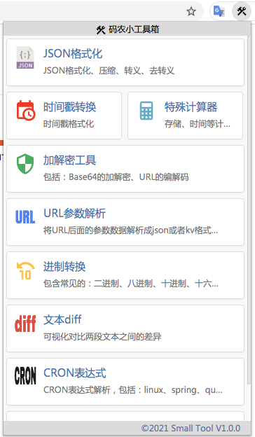

# Small Tool 🛠️

> A Chrome extension that puts a developer's most-used utilities one click away.
> 一款面向研发同学的浏览器小工具箱：JSON / SQL 格式化、加解密、时间戳、进制、子网掩码、CRON、文本 diff…… 全部本地运行，无任何数据外发。



---

## ✨ 特性总览

| 工具 | 功能简介 | 入口 |
|---|---|---|
| 🟣 **JSON 格式化** | 格式化 / 压缩 / 转义 / 去转义 / 折叠 / **拷贝（保留高亮）** | `json.html` · 大文本 → 新标签页 `json_all.html` |
| 🔵 **SQL 格式化** | 智能格式化 / 压缩 / 关键字大小写 / **彩虹括号 + 配对引导线** / 多方言 | `sql.html` · 大文本 → 新标签页 `sql_all.html` |
| 🔐 **编解码工具** | Base64 加解密 / URL 编解码 / **MD5 加密（32 位 + 16 位 / 大小写）** | `base64.html` |
| ⏰ **时间戳转换** | 10/13 位时间戳 ↔ 日期，时区无关 | `time.html` |
| 📅 **日历** | 公历 / 农历 / 节气 / 节假日 | `calendar.html` |
| 🌐 **URL 参数解析** | URL query 串 → JSON / k-v 表 | `url.html` |
| 🔁 **进制转换** | 二 / 八 / 十 / 十六进制互转 | `binary.html` |
| 🌳 **子网掩码** | IP + CIDR → 网络号 / 广播 / 第一可用 / 最后可用 / 可用 IP 数 | `subnet.html` |
| ⏱️ **CRON 表达式** | linux / spring / quartz 三种规则解析与下次触发时间 | `crontab.html` |
| 🔍 **文本 / JSON diff** | 可视化对比两段文本或 JSON | `diff.html` |

> 主页面工具卡片可 **拖拽排序**，顺序自动持久化，下次打开按你喜欢的顺序展示。

---

## 🟣 JSON 格式化

- **格式化 / 压缩 / 转义 / 去转义**：经典四件套
- **折叠展开**：超长 JSON 一键折叠成树形结构
- **拷贝按钮**（亮点）：同时写入 `text/html` 和 `text/plain` 两份剪贴板内容
  - 粘贴到 **VS Code / 终端**：保留 4 空格缩进的纯文本 JSON
  - 粘贴到 **Word / 飞书 / 企业微信**：保留语法高亮颜色
- **新标签页**：popup 中点击 JSON 图标 → 在独立标签页打开全屏版本，处理大 JSON 更舒服

---

## 🔵 SQL 格式化（最强力的工具）

### 多方言智能格式化
基于业界标杆 [`sql-formatter`](https://github.com/sql-formatter-org/sql-formatter)，支持 **15+ SQL 方言**：

```
PostgreSQL（默认，兼容 ClickHouse）/ MySQL / SQLite / BigQuery
Spark / Trino / Snowflake / Redshift / MariaDB / TiDB
Hive / DB2 / PL-SQL (Oracle) / T-SQL (SQL Server) / 通用 SQL
```

如果方言解析失败，会自动 **回退到内置的轻量自研引擎**。

### 智能函数括号识别（核心优化）
区分三种括号：
- **函数调用**：`COUNT(*)`、`IFNULL(score, 0)` → 参数保持单行
- **子查询**：`(SELECT ...)` → 换行 + 缩进
- **表名列清单**：`INSERT INTO users (id, name, email)` → 单行 + 留空格

### 🌈 彩虹括号 + 配对高亮 + 引导线（亮点）

| 场景 | 视觉反馈 |
|---|---|
| 默认显示 | 不同嵌套深度的括号自动着上不同颜色（金 / 紫 / 蓝 循环，VSCode 风格） |
| 点击括号 | 配对的两个括号高亮成 **黄底加粗** |
| 跨行配对 | 从开括号到闭括号画一条 **黄色虚线引导线**，方便定位巨型嵌套查询 |
| 未闭合括号 | 红底白字，提示语法错误 |

### 其它
- 关键字大小写一键切换
- 行宽可配置：80 / 100 / 120 / 160
- 拷贝按钮（同 JSON）：同时支持高亮粘贴和纯文本粘贴
- 选项自动持久化到 localStorage

---

## 🔐 编解码工具

三个 Tab：

### Base64
- Base64 加密 / 解密
- 上下交换按钮快速调换输入输出

### URL Encoding
- 使用 `encodeURIComponent / decodeURIComponent`
- 内置使用说明（`escape` vs `encodeURI` vs `encodeURIComponent`）

### MD5（新增亮点）
- **四种格式同时输出**：32 位小写 / 32 位大写 / 16 位小写 / 16 位大写
- **UTF-8 安全**：中文、emoji 等非 ASCII 字符也能正确加密
- **实时计算**：边输入边显示（200ms 防抖）
- **一键拷贝 32 位小写**结果
- 100% 浏览器本地完成，输入数据不会发往任何服务器

---

## 🌳 子网掩码计算

输入 4 段 IP + CIDR 掩码位，一键得出：

```
可用 IP    : 254
掩码      : 255.255.255.0
网络      : 10.0.0.0
第一可用  : 10.0.0.1
最后可用  : 10.0.0.254
广播      : 10.0.0.255
```

特殊处理：
- `/32`（单 IP）→ 可用 1
- `/31`（RFC 3021 点对点链路）→ 可用 2，无网络/广播
- `/0` → 全网络空间

输入辅助：满 3 位或输入 `.` 自动跳到下一段；输入有误时红字提示并定位光标。

---

## 🛡️ 隐私 & 安全

- 所有计算（含 MD5、JSON / SQL 格式化、子网掩码等）**100% 在浏览器本地执行**
- 没有任何外部网络请求，没有任何数据上报
- 无 `tabs` / `cookies` / `webRequest` 等敏感权限（详见 `manifest.json`）

---

## 🚀 安装与使用

### 方式 1：从源码加载（推荐）

```bash
git clone https://github.com/knowliu-alt/small_tool.git
```

1. 打开 `chrome://extensions`
2. 开启右上角"开发者模式"
3. 点击"加载已解压的扩展程序"
4. 选择本仓库根目录
5. 工具栏出现 🛠️ 图标即可使用

### 方式 2：固定标签页打开

部分大文本工具（JSON / SQL）支持在新标签页打开：

```
chrome-extension://<扩展ID>/json_all.html
chrome-extension://<扩展ID>/sql_all.html
```

也可以在 popup 里 **点击 JSON / SQL 图标** 直接打开。

---

## 🧰 技术栈

- 前端：jQuery 1.12 + jQuery UI（拖拽）+ Bootstrap 3
- JSON 渲染：[jquery.json-viewer](https://github.com/abodelot/jquery.json-viewer)
- SQL 解析：[sql-formatter](https://github.com/sql-formatter-org/sql-formatter)（UMD 本地打包，约 230KB）
- MD5：基于 Joseph Myers 的公开实现，UTF-8 安全
- 文本 Diff：[jsondiffpatch](https://github.com/benjamine/jsondiffpatch)
- Manifest V3

---

## 🛣️ Roadmap

- [ ] JSON 工具新增"按 JSONPath 查询"功能
- [ ] SQL 工具支持执行计划可视化
- [ ] MD5 之外补充 SHA-1 / SHA-256 / SHA-512
- [ ] 暗色 / 亮色主题切换
- [ ] i18n（英文界面）

---

## 🤝 贡献

欢迎 PR 和 issue。提 PR 前请确认：
1. 不引入新的网络权限
2. 不引入对 CDN 的运行时依赖（所有库都打包在 `js/lib/`）
3. 在 `popup.html` 注册新工具入口（参考 `subnet.html` 的接入方式）

---

## 📜 License

MIT © Small Tool contributors
